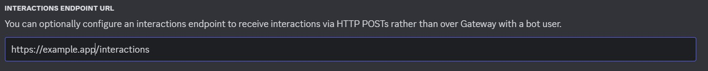
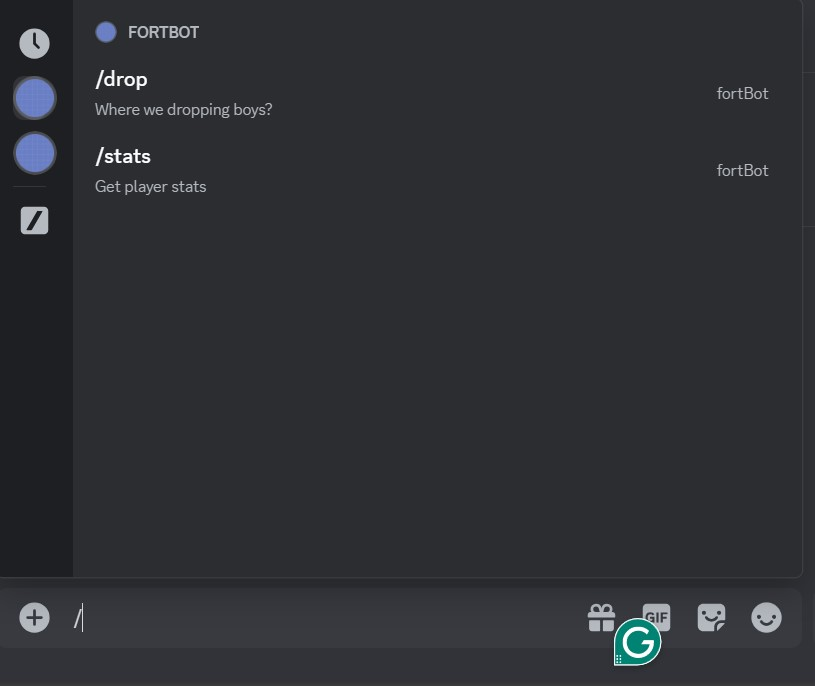

# Fort_bot

## Requirements

- [Node](https://nodejs.org/en/)
- [NPM](https://www.npmjs.com/)
- [Ngrok](https://download.ngrok.com/windows) (for testing on local machine)

## Getting Started

First, make sure you have all the requirements installed on your local machine.

### Installation

```
# Clone the repository
git clone https://github.com/TrevorStreng/fort_bot.git

# Naviagte to directory
cd fort_bot/functions

# Install the dependecies
npm i

# Install nodemon (optional)
npm i nodemon
```

## Environment Variables

We need to get environment variables from the [Discord Developer Portal](https://discord.com/developers/applications)

- create new discord application

```
APP_ID=<APPLICATION_ID>
DISCORD_TOKEN=<TOKEN>
PUBLIC_KEY=<PUBLIC_KEY>
FORTNITE_KEY=<FORTNITE_API_KEY>
ENVIRONMENT=dev
```

- application_id and public_key can be found in GENERAL INFORMATION tab
- discord_token can be found in BOT tab.
- FORTNITE_API_KEY can be obtained through [fortnite api](https://dash.fortnite-api.com/endpoints/stats) and following the instructions under the Headers section.

## Running the application

First run the application on your machine.

(If you are not using nodemon, change package.json "dev" script to "node app.js")

```
npm run dev
```

In a command line navigate to ngrok folder and run.

```
# Navitage to folder
cd ngrok-v3-stable-windows-amd64

# Create encrypted tunnel
ngrok http 3000
```

- Copy the "forwarding" address paste in Interactions endpoint url in Discord Developer GENERAL INFORMATION tab.
- Append "/interactions" to end of interactions endpoint url.



## Deploying Commands

```
npm run register
```

Follow instructions on Discord Developer Portal to install bot to a server.


